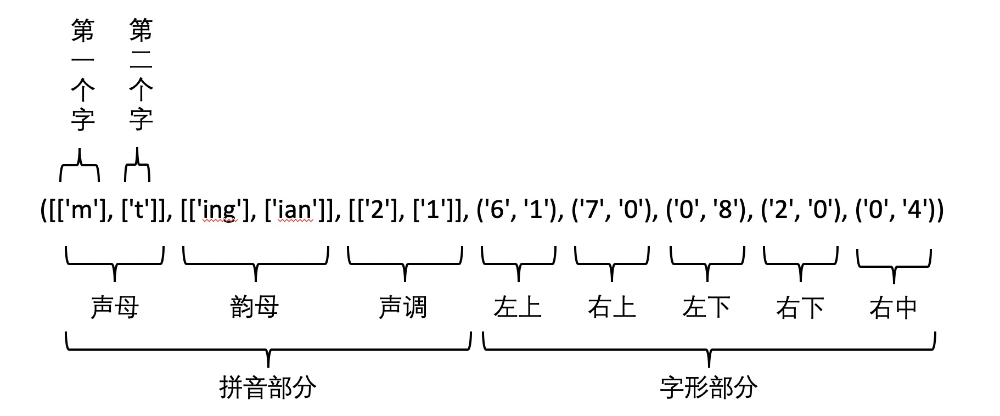

# 汉字字符特征提取器（featurizer）

在深度学习中，很多场合需要提取汉字的特征（发音特征、字形特征）。本项目提供了一个通用的字符特征提取框架，并内建了 `拼音`、`字形`（四角编码） 和 `部首拆解` 的特征。

## 特征提取器
* 拼音特征提取器：提取汉字的拼音作为特征，发音相似的字在编码上应该相似。示例： `胡` -> `hú`，`福` -> `fú`
* 字形（四角编码）提取器：提取中文的外形作为特征，相似的汉字在编码上应该相近。示例：`门` -> `37001`，`闩` -> `37101`
* 部首拆解提取器：提取汉字的偏旁部首拆解作为特征，相似的汉字在编码上应该相近。示例：`闩` -> `['门', '一']`，`闫` -> `['门', '三']`

## 使用
```python
from hanzi_char_featurizer import Featurizor

featurizor = Featurizor()
result = featurizor.featurize('明天')
print(result)
```

输出
```text
([['m'], ['t']], [['ing'], ['ian']], [['2'], ['1']], ('6', '1'), ('7', '0'), ('0', '8'), ('2', '0'), ('0', '4'))
```

## 结构解析


## 输出到 TensorFlow 作为 Tensor
```python
import tensorflow as tf

import hanzi_char_featurizer

feature = hanzi_char_featurizer.featurize_as_tensor('./usage/data.txt')

with tf.Session() as sess:
    sess.run(tf.initializers.tables_initializer())
    for _ in range(1):
        print('+' * 20)
        data = sess.run(feature)
        print(data)
```

输出
```text
++++++++++++++++++++
[[0. 0. 0. 0. 0. 0. 0. 0. 0. 0. 0. 0. 0. 1. 0. 0. 0. 0. 0. 0. 0. 0. 0. 0.
  0. 0. 0. 0. 0. 0. 0. 0. 0. 0. 0. 1. 0. 0. 0. 0. 0. 0. 0. 0. 0. 0. 0. 0.
  0. 0. 0. 0. 0. 0. 0. 0. 0. 0. 1. 0. 0. 0. 0. 1. 0. 0. 0. 0. 0. 0. 0. 0.
  1. 0. 0. 0. 0. 0. 0. 0. 0. 0. 0. 1. 0. 0. 0. 0. 0. 0. 0. 0. 0. 1. 0. 0.
  0. 0. 0. 0. 0. 0. 1. 0. 0. 0.]]
```

## TODO
* 增加 Unicode 的 IDS 表征，来自 爱奇艺 FASPell 模型

## 在使用 hanzi_char_featurizer 的公司列表

<a here="https://www.huya.com/"></a>

